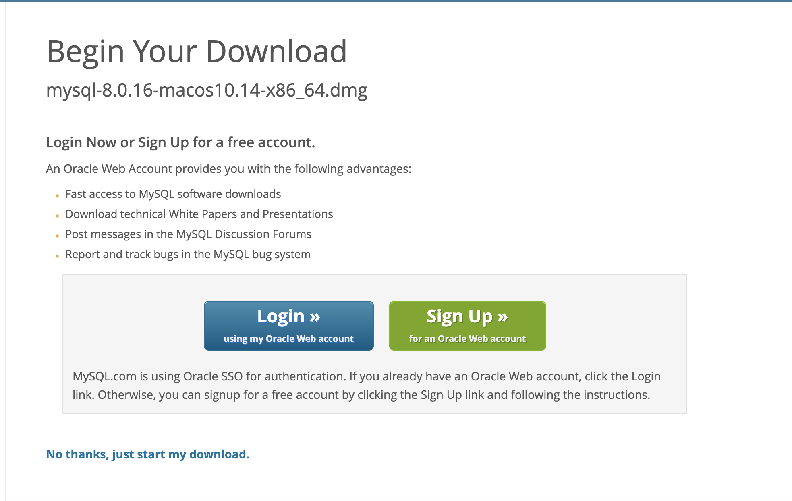

# Vend-O-Matic

## Necessary Installs

### Flask

To install flask, insert the following command into your terminal.

```
pip install flask
```
If you receive an error saying the command 'pip' is not found, then try the same command but with 'pip3' instead.

```
pip3 install flask
```
### Flask-MySQL

To install MySQL, insert the following command into your terminal.

```
pip install flask-mysql
```
If you receive an error saying the command 'pip' is not found, then try the same command but with 'pip3' instead.

```
pip3 install flask-mysql
```

### MySQL Community Server

To go to the website to download, <a href="https://dev.mysql.com/downloads/mysql/">click here</a>.

Choose the download that matches your systems settings.


Then begin your download. You can click "No thanks, just start my download" at the bottom.


* **At the end of this process, you will be given a temporary password, but will be given the chance to create your own.**

* **You will need this password to gain access to the MySQL database.**

### HTTP Test Environment: Insomnia, Postman, *etc.*

Some type of HTTP software will be needed to test my api calls because I wasn't able to implement a front-end that would allow for put request to be made in the browser.

I used insomnia to test my api endpoints, so I included an export of my workspace in the repository. I'll also make sure to send that along in the email to Brendan.

*Insomnia* -
<a href="https://insomnia.rest/download/">
Click here
</a> to download
<hr>


*Postman* -
<a href="https://www.getpostman.com/downloads/">
Click here
</a> to download
<hr>


<hr>

# Getting Started

## Log into MySQL

Log into MySQL from command terminal by typing the following command:
```
mysql -u root -p
```
The terminal will then prompt you to enter your password.


If your password was entered correctly, you should see the following screen appear.


You'll also want to copy that password into the main.py file as shown here:


## Loading Vend-O-Matic Data

At this point, you'll want to copy the sql script that will create the database and tables, load the tables and will also display all the data from each table. The script is provided here and also in the repository above.

```
CREATE DATABASE Testing;
USE Testing;

CREATE TABLE Drinks ( id int NOT NULL, name VARCHAR(50) NOT NULL, quarters int NOT NULL, quantity int NOT NULL, vending_machine_id int NOT NULL, PRIMARY KEY (id));

INSERT INTO Drinks (id, name, quarters, quantity, vending_machine_id)
VAlUES(1, 'Coca-cola', 2, 5, 1);

INSERT INTO Drinks (id, name, quarters, quantity, vending_machine_id)
VAlUES(2, 'Sprite', 2, 5, 1);

INSERT INTO Drinks (id, name, quarters, quantity, vending_machine_id)
VAlUES(3, 'Pepsi', 2, 5, 1);


CREATE TABLE Vending_Machine (id int NOT NULL, coin_quantity int NOT NULL, temp_coin_quantity_id int NOT NULL, PRIMARY KEY (id));

INSERT INTO Vending_Machine (id, coin_quantity, temp_coin_quantity_id)
VALUES(1, 0, 1);


CREATE TABLE Temp_Coin_Quantity (id int NOT NULL, temp_coins int NOT NULL, PRIMARY KEY (id));

INSERT INTO Temp_Coin_Quantity (id, temp_coins)
VALUES(1, 0);

select * from drinks;
select * from vending_machine;
select * from temp_coin_quantity;

```

Your terminal should show table data like this:


## Running your Local Server

To achieve running the local server, you will open another terminal window and navigate to the /my_flask_app directory and then run the main.py file by using the following command:

```
python main.py
```
If that command doesn't work then try:
```
python3 main.py
```

If the file successfully loaded, it should look like this:


## You should now be able to make api calls that will manipulate your local database!

# Something to note!

For the api specifications where it stated I should use a DELETE request to return coins to the customer...


 I ended up using a PUT request instead. My logic was that if I were to use a DELETE request, then I would have to assume that each coin that is added is it's own entity, therefore a POST request would be required to increment, but a POST request wasn't mentioned in the specs.

Maybe this could have been done by adding coins using a PUT and changing the value using a DELETE, but I couldn't figure out a way to do it. That's why I chose to substitute the DELETE for another PUT request with the '/subtract' value in the route.

I also was not successful with returning all of the headers. The only one I managed to get working was the one that shows the number of coins to be returned.


If I don't get the chance to speak with you again, I'll just say that I appreciate the opportunity! :)